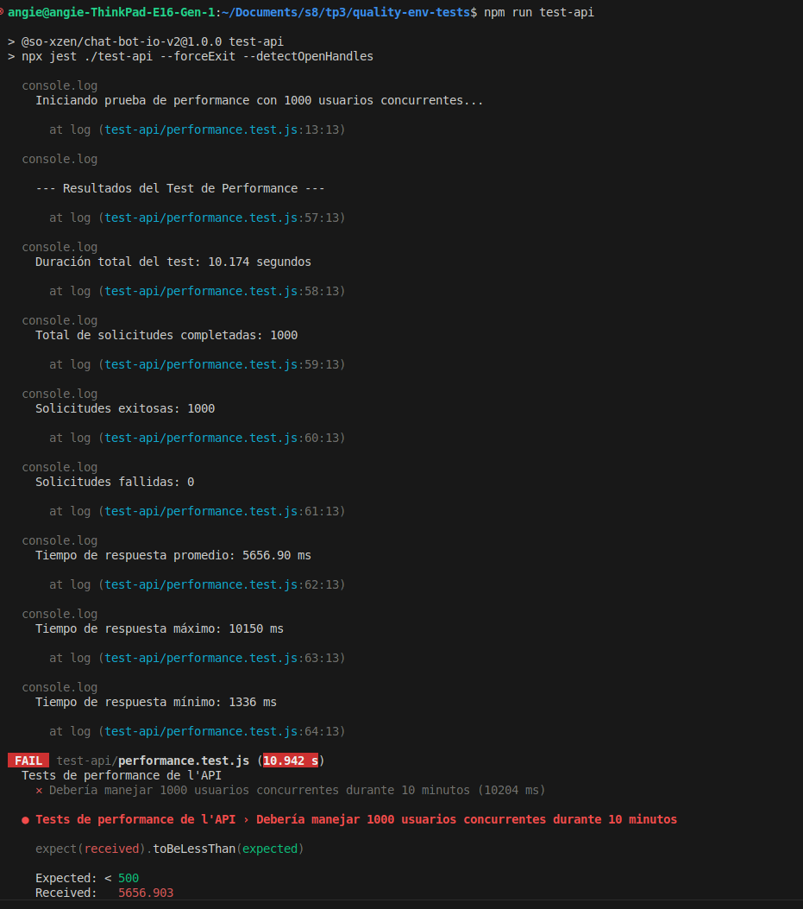

# Projet Chat Bot IO v2

## Tests de Performance

### Objectif

Le test de performance a pour but de simuler un trafic de 1000 utilisateurs simultanés pendant une durée de 10 minutes. Les métriques suivantes sont mesurées pour évaluer les performances de l'API :
- Temps de réponse moyen.
- Temps de réponse maximum et minimum.
- Taux de succès des requêtes.

### Résultats du Test



Le test a révélé les points suivants :

- **Temps de réponse moyen** : `5656.90 ms`, supérieur à la limite attendue de `500 ms`.
- **Temps de réponse maximum** : `10150 ms`.
- **Temps de réponse minimum** : `1336 ms`.
- **Requêtes réussies** : `1000`.
- **Requêtes échouées** : `0`.

---

### Analyse des Résultats

1. **Temps de réponse moyen élevé** : L'API met plus de temps que prévu pour répondre, ce qui pourrait indiquer des problèmes de performances sous une charge importante.
2. **Temps de réponse maximum élevé** : Un temps de réponse de plus de 10 secondes pour certaines requêtes suggère que l'API rencontre des difficultés pour traiter certaines opérations de manière efficace.

### Problèmes Identifiés

- **Temps de réponse élevé** : L'API n'atteint pas les performances souhaitées avec un temps de réponse moyen supérieur à `500 ms`.
- **Gestion sous charge** : Bien que toutes les requêtes aient été traitées, le temps de réponse élevé sous charge indique un potentiel goulot d'étranglement.

---

## Commandes du Projet

### Lancer l'API

```bash
npm run api-start
```

### Lancer les tests de performance

```bash
npm run test-api
```

## Dépendances

    Backend : Express, Mongoose, jsonwebtoken.
    Tests : Jest, Supertest.
